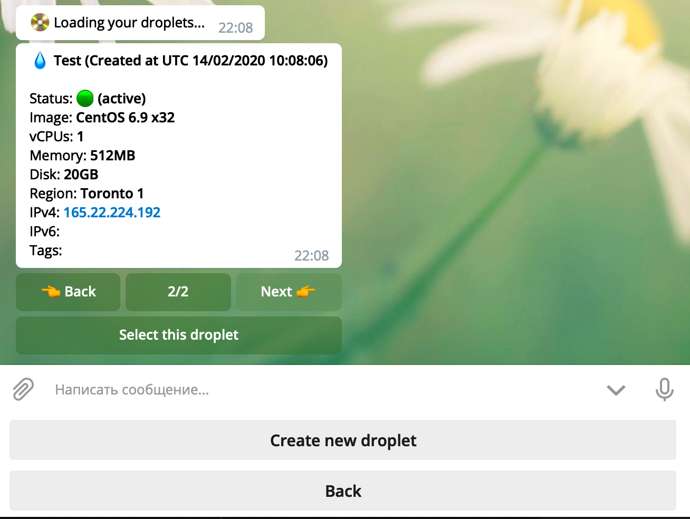
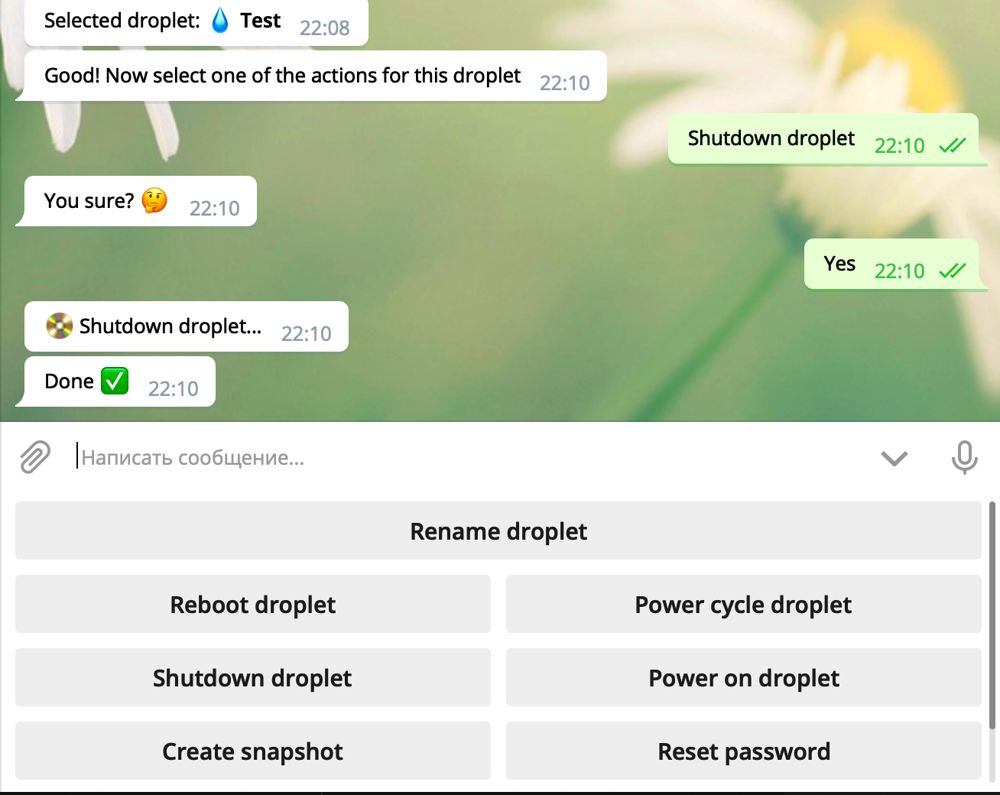
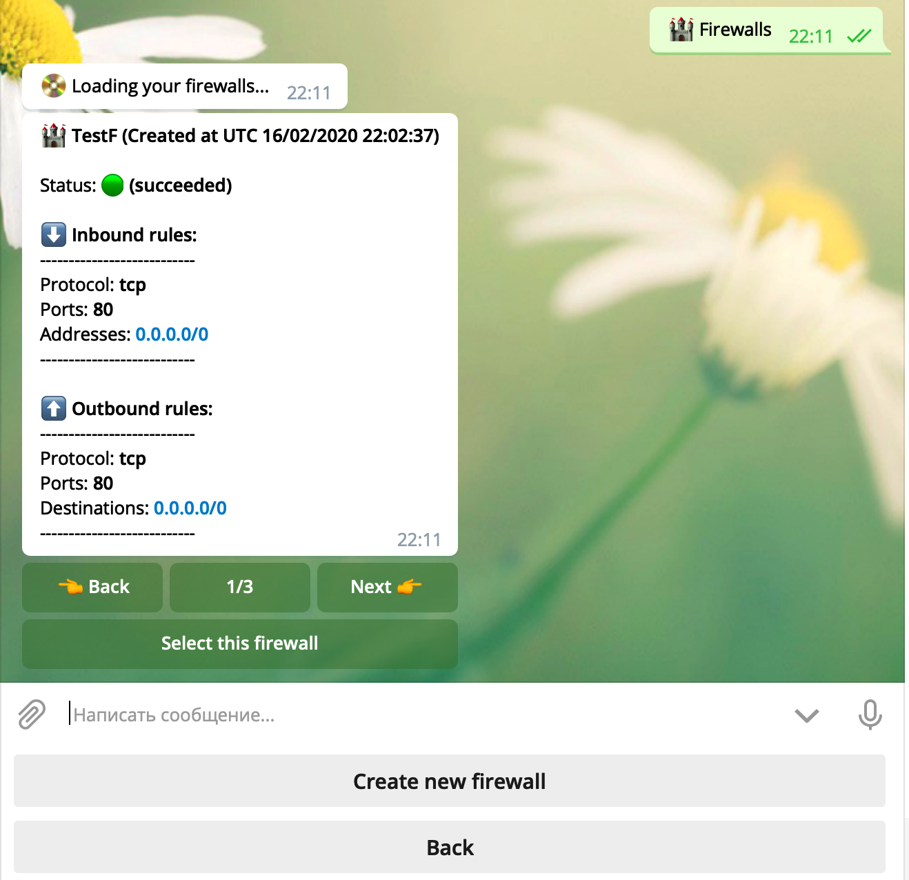

# :ocean: **DigitalOcean for Telegram**
  

**This bot for easy manager your droplets, firewalls and etc from Telegram messenger** :star2:

**Link:** [DigitalOceanBot](https://t.me/DigitalOceanDropletBot)

## :boom: Available functional in bot: :boom:
**Account** :ocean:
+ Account information
+ Balance

**Droplets** :droplet:
+ Create new droplet
+ Rename droplet
+ Reboot droplet
+ Power cycle droplet
+ Shutdouwn droplet
+ Power on droplet
+ Create snaphot
+ Reset password

**Firewalls** :european_castle:
+ Create new firewall
+ Add inbound rule to firewall
+ Add outbound rule to firewall
+ Add droplets to firewall
+ Remove droplets from firewall

## Missing functional (in development)
+ Projects
+ Block Storage
+ CDN Endpoints
+ Certificates
+ Databases
+ Domains
+ Domain Records
+ Floating IPs
+ Snapshots
+ Kubernetes
+ Load Balancers

## Built With :heart:
+ [TelegramBot API .NET](https://github.com/TelegramBots/Telegram.Bot)
+ [DigitalOcean API .NET](https://github.com/trmcnvn/DigitalOcean.API)
+ [MongoDB](https://github.com/mongodb/mongo)
+ [RabbitMQ](https://github.com/rabbitmq/rabbitmq-server)
+ [EasyNetQ](https://github.com/EasyNetQ/EasyNetQ)
+ [Serilog](https://github.com/serilog/serilog)

## Screenshots

## References
+ [LICENSE](LICENSE)
+ [CHANGELOG](CHANGELOG.MD)
